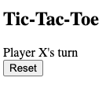
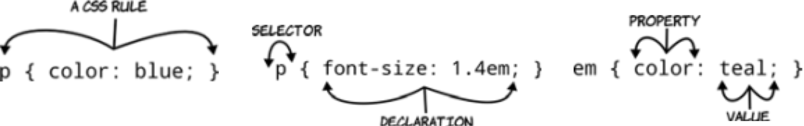
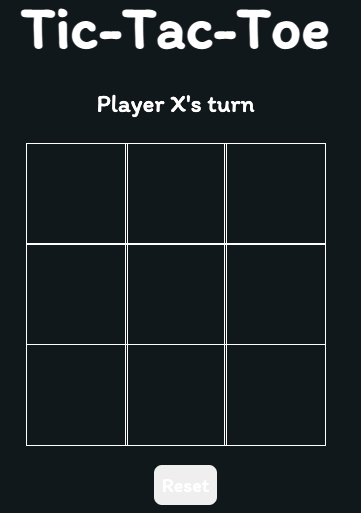
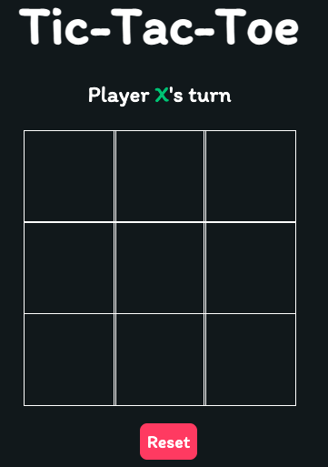

# Digital Futures Software Engineering Taster Session Solution

A Pen created on CodePen.io. Original URL: [https://codepen.io/edwright75/pen/NWXJYPw](https://codepen.io/edwright75/pen/NWXJYPw).

## Tic-Tac-Toe

The aim of this activity is to add to the code-base for a partially complete *Tic-Tac-Toe* game to be able to play.

Use the link above to be taken to **CodePen** which will give you the skeleton code that you need and the instructions below to help you complete the code.

---
## Activity 1 - Complete the User Interface structure

The page needs some additional HTML code to complete the structure of the user interface.

HTML uses elements to provide structure.  These are usually defined by **tags** that come in pairs (there are some exceptions to this rule though!). The structure can be annotated by adding **attributes** to the opening tag of a pair.  Common attributes are `id` and `class`.  These are often used to help style the elements.

You will have 10 minutes to complete this with your pair partner.

### Working in the HTML Tab...

1. Add a title of **Tic-Tac-Toe** in between the `<h1></h1>` tags on the page
2. Put a `<span></span>` tag with a class attribute of `display-player playerX` around the `X` in the text `Player X's turn` 
3. Insert 9 `<div></div>` tags, each with an attribute called `class` with the value `tile`
4. Insert a `<section></section>` tag with the `class`es: `display`; `announcer`; and `hide`
5. Insert a `<button></button>` tag with an `id` attribute of `reset` that displays the text `Reset`

Your completed code should look like:



---

## Activity 2 - Make the User Interface look nice using CSS

To make the page look nice and for the actual game grid to appear, some styling rules need to be defined.  CodePen will automatically add these rules to the HTML.

Most of the CSS has been provided for you and needs uncovering in the CSS tab.  However, some crucial rules have not been implemented.

A CSS rule consists of 2 parts:

- A ***selector*** and a ***declaration***
  - The *selector* defines which HTML to attach the styling to, e.g `body`, `.a-class`, `#an-id` (and more complicated things!)
  - The *declaration* defines the styling to attach
  
The ***declaration*** itself is split into 2 parts:

- The ***property*** and the ***value***
  - The *property* is what to style, e.g. `border`, `margin`, `font-family`, `color`, etc
  - The *value* is the value to assign to the property, e.g. `2px`, `100%`, `cursive`, `red`

.

***Note:*** to select an element with a particular `class` attribute, start the selector with a `.` immediately followed by the value, so for any element with a `class` of `myClass` (e.g. `<div class="myClass"></div>`) use `.myClass`.

***Note:*** to select an element with a particular `id` attribute, start the selector with a `#` immediately followed by the value, so for any element with an `id` of `myElement` (e.g. `<div id="myElement"></div>`) use `#myElement`.

You will have 10 minutes to complete this with your pair partner.  You may continue from the previous CodePen window.

If you did not complete or get to the solution for Activity 1, please use: [https://codepen.io/edwright75/pen/MWrxVmZ](https://codepen.io/edwright75/pen/MWrxVmZ)

### Working in the CSS Tab...

1. Remove the comment delimiters from the code in the CSS window (i.e remove `/*` at the top and `*/` at the bottom of the code)
2. Add a new rule for a `class` of `tile` and set the following properties to the values:

| Property          | Value             | Description                                                                                                                              |
| ----------------- | ----------------- | ---------------------------------------------------------------------------------------------------------------------------------------- |
| `border`          | `1px solid white` | Sets the border of the element to a solid white line 1 pixel thick                                                                       |
| `min-width`       | `100px`           | Sets the minimum width of the element to 100 pixels                                                                                      |
| `max-width`       | `100px`           | Sets the maximum width of the element to 100 pixels                                                                                      |
| `display`         | `flex`            | Sets the display style to use the `flex` rules                                                                                           |
| `justify-content` | `center`          | Defines how the browser distributes space between and around content items along the main-axis of a flex container in this case centered |
| `align-items`     | `center`          | Sets the align-self value on all direct children as a group                                                                              |
| `font-size`       | `50px`            | Sets the font-size of the text within this element to be 50 pixels                                                                       |
| `cursor`          | `pointer`         | Makes sure that the cursor presents as a pointer when the element is mouse-overed                                                        |

Your display should look like this after correct implementation of the above rule:



3. Add a rule for a `class` of `playerX` that sets the `color` property, nominally to `#09C372`
   - This should change the display colour of the `X` in the turn text and will also be used to colour the `X` that will be placed in the grid

4. Add a rule for a `class` of `playerO` that sets the `color` property, nominally to `#498AFB`
   - When the other player is having a turn this will set the colour of the `O` in the turn text and the colour of the `O` placed in the grid

5. Add a rule for an element that has an `id` of `reset` and set the `background-color` property to `#FF3860`
   - This should change the background colour of any element that has an `id` property of `reset` to a shade of red

### If you have time...

Experiment with the colours.  Find out if there are different ways colours can be represented.

You may want to start [here](https://developer.mozilla.org/en-US/docs/Web/CSS/color_value).

Your completed code (if you have used the values supplied) should look like:



---

## Activity 3 - Make the game interactive using JavaScript

JavaScript is the beating heart of any interactive web page.  In this activity we will implement some JavaScript code to make the game play.

You will have 20 minutes to complete this with your pair partner.  You may continue from the previous CodePen window.

If you did not complete or get to the solution for Activity 2, please use: [https://codepen.io/edwright75/pen/ExoMRrG](https://codepen.io/edwright75/pen/ExoMRrG).

### Working in the JS Tab...

Have a read through the code and see if you can understand any of the code - use the comments to help.
   
The `changePlayer` function does what you may expect - it toggles which player is the current player.  On Line 45 there is a comment within the brackets that says `/* Replace Me 1 */` - we are going to change this so it removes the class for the current player on the HTML page and therefore the styling applied to it.  This is linked to the `playerDisplay` element in the HTML. 

1. Put the following in place of the whole comment, leaving the **back-tics** in place:

```js
player${currentPlayer}

// So the line reads

playerDisplay.classList.remove(`player${currentPlayer}`);

```

2. Replace the comment `/* Replace Me 2 /*` on line 51 with the same code you replaced the first comment with.

The `checkWinCondition` function checks the state of the board against the winning conditions specified.  We need to complete this function so that it actually returns if there is a winner or not

3. Replace the comment `/* REPLACE ME 3 - Add a line here to return the value of roundWon */` on line 70 with:

```js
return roundWon;
```

This will either be `true` or `false` depending on the result of the checks.

The `handleResultValidation` function should call checkWinCondition and make the game announce a winner (or a tie).  We need to make this happen!

4. Change the declaration of `winCondition` on line 75 from `false` to a call to `checkWinCondition`.  Function calls should be their name followed by a pair of brackets:

```js
const winCondition = checkWinCondition();
```

5.  Replace the comment `/* REPLACE ME 5 - Call annouce with PLAYERX_WON if currentPlayer is X or PLAYERO_WON if not */` with the following code:

```js
announce(currentPlayer === `X` ? PLAYERX_WON : PLAYERO_WON);
```

We are calling the `announce` function here - but it needs to know what it is announcing.  Inside the brackets is a **ternary** statement.  This is shorthand syntax for an `if-else` statement.  To the left of the `?` is a *conditional statement* that is `true` or `false` - `currentPlayer` is either the value `X` or not!  If it is, `announce` will use `PLAYERX_WON` otherwise it will use `PLAYERO_WON`.  

If there is no winner and there are no spaces left for players to fill on the board, we need to `announce` a `TIE`

6.  Replace the comment `/* REPLACE ME 6 - declare a TIE if the board array does not include an empty string */` with the following:

```js
if(!board.includes(``)) announce(TIE);
```

The `includes` function here is a special function only available to arrays - it returns true if the value in the brackets is one of the elements in the array and false if it is not.  The `!` inverses the result, so `true` becomes `false` and vice-versa.

The `userAction` function will be executed when a player clicks on a tile on the board.  We will need to know which tile has been clicked and the index of the tile in the array of tiles.  We only execute the rest of this function if clicking on that tile is a valid action and the game is still playing.

7. Add the current player's symbol to the tile by replacing the comment `/* REPLACE ME 7 - put the player's mark in the tile */` with

```js
tile.textContent = currentPlayer;
```

8. Colour the player's symbol by adding the player's class to the tile.  Replace the comment `/* REPLACE ME 8 - add the player to the classList on the tile */` with

```js
tile.classList.add(`player${currentPlayer}`);
```

The rest of this function makes sure that the board updates, if a winner can be declared and changes the player over.

The `isValidAction` function is there to make sure that the user can only activate an empty tile.  To do this it must return `false` if the tile is already occupied or `true` if not.

9. Replace the comment `/* REPLACE ME 9 - return true unless the textContent of the tile is X or O */` with

```js
  return tile.textContent === `X` || tile.textContent === `O` ? false : true;
```

The `||` here allows us to perform a logical **OR** operation - if the tile has an `X` OR `O` in it, then the statement is `true`.

The `announce` function uses conditional logic to populate the HTML inside the element with the `announcer` class on it.  It also removes the `hide` class from the element and adds the `hide` class to the `display` element.  This has the effect of showing the winner and hiding the next turn information.

The `updateBoard` function simply sets the `board` array element at the supplied `index` to the `currentPlayer` value - helping us determine the state of the game.

`resetTiles` visits each `tile`, removes the `X` or `O` and any player related classes from it.

`resetBoard` function will be called when the ***Reset*** button is clicked.  It does as you expect, making sure that the game is entirely put back to the initial condition.  The board array is cleared, the game becomes active again and the correct messages are shown by adding or removing the `hide` class.

Our game is ready to play.  The last piece in this puzzle is to make the HTML elements recognise that they can be clicked.  We have 10 clickable items in the game:  the 9 tiles and the Reset button.  Event Listeners are used to recognise may user actions, clicking, mouse moving and pressing keys are just some of these.  There are also other events that are triggered automatically.

As the 9 tiles are in an array, we can use a loop to visit each tile and attach some code to it via an event listener.

10.  Replace the comment `/* REPLACE ME 10 - visit each tile and index, attaching an click event listener and calling userAction with the tile and the index */` with the following code:

```js
tiles.forEach((tile, index) => {
  tile.addEventListener(`click`, () => userAction(tile, index));
});
```

Essentially, when an individual tile element is now clicked, the `userAction` function will be called with the `tile` that has been clicked and the `index` of the `tile` in the `tiles` array.

Finally, add an event listener to the button to call the `resetBoard` function when the button is clicked.

11. Replace the comment `/* REPLACE ME 11 - tell the resetButton to call resetBoard when clicked */` with

```js
resetButton.addEventListener(`click`, resetBoard);
```

### Play the game!

You should have a functional game in your window now!  If your game appears not to work, click on the `console` button in the bottom left of the screen.  If you can see red messages then this means that there are errors in the code you have typed.

The working solution can be seen at this Pen [https://codepen.io/edwright75/pen/ExoMxYB](https://codepen.io/edwright75/pen/ExoMxYB). Opening this in a new tab and comparing your code to it may help debug your own code.  The error messages usually suggest a line number where the error has occurred.

You can also find the solution code in the `src` folder of this repository.  You are able to **clone** and/or **download** this repository.